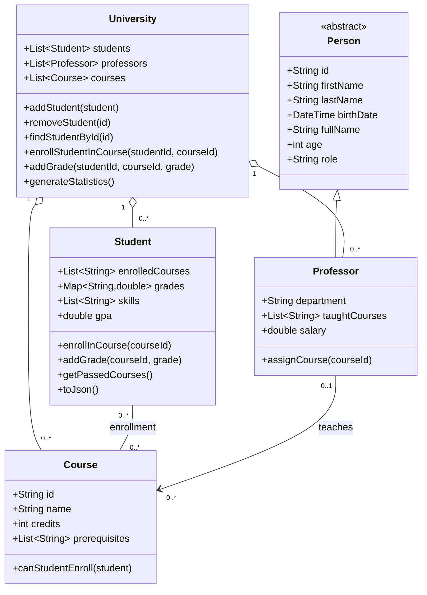

# University Management System — UML

```mermaid
classDiagram
  class Person {
    <<abstract>>
    +String id
    +String firstName
    +String lastName
    +DateTime birthDate
    +String fullName
    +int age
    +String role
  }
  class Professor {
    +String department
    +List~String~ taughtCourses
    +double salary
    +assignCourse(courseId)
  }
  class Student {
    +List~String~ enrolledCourses
    +Map~String,double~ grades
    +List~String~ skills
    +double gpa
    +enrollInCourse(courseId)
    +addGrade(courseId, grade)
    +getPassedCourses()
    +toJson()
  }
  class Course {
    +String id
    +String name
    +int credits
    +List~String~ prerequisites
    +canStudentEnroll(student)
  }
  class University {
    +List~Student~ students
    +List~Professor~ professors
    +List~Course~ courses
    +addStudent(student)
    +removeStudent(id)
    +findStudentById(id)
    +enrollStudentInCourse(studentId, courseId)
    +addGrade(studentId, courseId, grade)
    +generateStatistics()
  }
  Person <|-- Professor
  University "1" o-- "0..*" Student
  University "1" o-- "0..*" Professor
  University "1" o-- "0..*" Course
  Student "0..*" -- "0..*" Course : enrollment
  Professor "0..1" --> "0..*" Course : teaches
```
